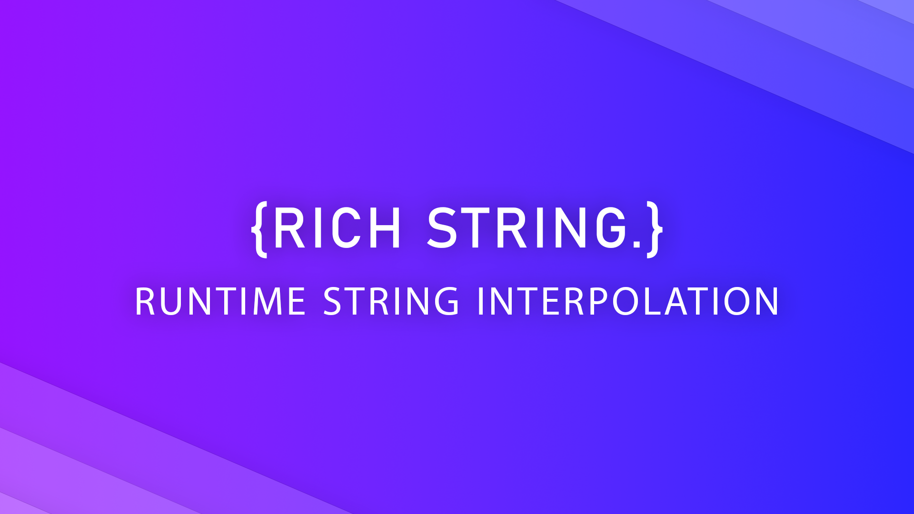

# RichString
 A dynamic, runtime string interpolation tool for Unity, supporting custom formatting and expressions.
 ## Features:
- **Dynamic string interpolation** at runtime.
- Support for **custom formats** via `IRichStringCustomFormat`.
- **Rich text** parsing and rendering.
- **Property referencing** for objects and collections (`IEnumerable`).
- Easily extensible and configurable error handling modes.

# Get Started
 Welcome to RichString, a powerful runtime string interpolation solution designed specifically for Unity. This guide will walk you through the installation process and help you get started using RichString in your project.
## Installation
### Manual (Unity Package)
 Download the latest release from the [GitHub releases page](https://github.com/AAuraDev/RichString/releases). Simply extract the files and place the RichString folder anywhere in your Unity project’s `Assets` directory. Done!
 
 ---
 
# Basic Usage
The following example demonstrates how RichString can be used to interpolate strings at runtime.
## Example
### Simple Weapon Description
A simple example is provided where a `Weapon` class and an `Inventory` class are defined. `RichString` will be used to dynamically reference properties from these classes in runtime string expressions.

#### Define the `Weapon` Class
  A basic `Weapon` class with properties such as `Damage` and `FireRate` is defined:
```csharp
public class Weapon
{
    [field: SerializeField] public int damage { get; private set; }
    [field: SerializeField] public int fireRate { get; private set; }
}
```
#### Define the `Inventory` Class
 Here’s a basic `Inventory` class containing `RichString` and `MaxSlots` fields, along with a `Weapon` instance and a list of `Weapon`. The `RichString` object must be initialized with the object whose properties are going to be referenced (in this case, this). Initialization must be performed in the `Start()` or `Awake()` method (in a `MonoBehaviour`) or anywhere **before** invoking `GetParsedString()`.

 To get the final parsed string, `GetParsedString()` should be called.
 
```csharp
public class Inventory : MonoBehavior
{
    [SerializeField] RichString _description;

    [field: SerializeField] public int MaxSlots { get; set; }
    [field: SerializeField] public List<Weapon> weapons { get; private set; } = new();
    [field: SerializeField] public Weapon mainWeapon { get; private set; }

    public void Start()
    {
      _description.Initialize(this);
    }

    public string GetDescription()
    {
      return _description.GetParsedString();
    }
}
```
#### Write Description
 Texts and expressions can be written using `RichString` by following the rules in the next section [Expressions](#expressions).

# Expressions
 **Rules for Writing Expressions with RichString**

 This section outlines the rules for crafting expressions using the powerful RichString system, which allows for seamless property referencing and rich text formatting. By following these guidelines, you can create dynamic strings that enhance the   interactivity and visual appeal of your content.

 While the specifiers shown here are the defaults, they can be customized to fit your needs via `RichStringSettings` in the asset folder.
## **Property Referencing**
 
 - **Property Reference**
   
   A property can be referenced by placing the property name within curly braces `{}`.
   
   ```
   Your Inventory has {MaxSlots} max slots.  
   ```

 - **Property in an Instance**

   To reference a property of a nested object, a dot `.` should be used to access the property, similar to regular code.

   ```
   Your Main Weapon deals {mainWeapon.damage} damage.
   ```
   > It can be chained as many times as desired:
   > ```
   > {Instance1.Instance2.Instance3.Instance4.Instance5}
   > ```

 - **Element of an `IEnumerable`**

   An element from an `IEnumerable` can be accessed by using the arrow `->` to separate the property name from the desired index.

   > These references can also be nested to access properties of objects contained within collections.

   ```
   Your First Weapon deals {weapons->0.damage}
   ```

## Rich Text

 - **Formatting**
   
   To apply formatting to the text, a colon `:` should be placed between the text and the formatting specifier within square brackets `[]`. The default formatting specifiers are as follows:

   Bold: `b`

   Italic: `i`

   Strikethrough: `s`

   Underline: `u`

   ```
   I am [Bold:b].
   ```
   
   These formatting specifiers also can be nested to create combinations:

   ```
   I am [Bold and Italic!:b:i].
   ```
   A property can also be referenced as the text:

   ```
   Your Main Weapon deals [{mainWeapon.damage}:b:u].
   ```

 - **Colorizing**
   
   To colorize a part of the text, first, the `Color Key`s must be declared in the `RichStringSettings` in the asset folder.

   To apply a color, the color key should be placed as a formatting specifier within square brackets [], similar to how bold or italic formatting is applied.

   ```
   I am [Green:green]!
   I am [Green and Bold:green:b]!
   ```
   > Using default Unity colors (like green, red etc.) is not supported in this version. For using them, they must be declared in `RichStringSettings`.

As with all other features in RichString, these formatting options can be seamlessly nested, allowing for powerful and flexible text manipulation.

```
Your Main Weapon deals [{mainWeapon.damage}:b:u:red].
```

These are all the rules to be followed in the current version, but more will be added in future updates.

# Custom Formatting
 Until now, referencing a property would replace it with its value. Types such as `int` or `string` have string=friendy values. But what if we want to reference a custom type? In this case, the `IRichStringCustomFormat` interface can be utilized.

 ```csharp
 public interface IRichStringCustomFormat
 {
     public string GetNormalForm();
     public string GetAlternateForm();
 }
 ```

 The `GetParsedString()` method has a boolean parameter called `alternate`, which defaults to `false`. If this parameter is set to `true`, references will be replaced with `GetAlternateForm()`. If it is set to `false`, they will be replaced with `GetNormalForm()`, provided that `IRichStringCustomFormat` has been implemented.

 > One example of an Alternate Form use case is when a player is required to hold a certain key to receive additional information in the description, prompting the same properties to change to a more informative and expanded form.

 ```csharp
 public class Weapon : IRichStringCustomFormat
 {
    [field: SerializeField] public int damage { get; private set; }
    [field: SerializeField] public int fireRate { get; private set; }

    public string GetNormalForm()
    {
       return $"Damage: {damage}";
    }
    public string GetAlternateForm()
    {
       return $"Damage: {damage}, Fire Rate: {fireRate}";
    }
 }
 ```

# RichString Extensions
 The `RichStringExtensions` class provides a set of extension methods that can be utilized in code to apply rich text formatting easily. These methods enable developers to enhance the presentation of strings by incorporating various styles directly within their code.

 ```csharp
string text = "Some text";
text = text.Bold().Colorize(Color.green);
 ```

 > It may be beneficial for developers to leverage these extensions when implementing custom formatting in the `IRichStringCustomFormat` interface.

# RichReference Attribute 
 When referencing a property, the property name used in code should be utilized (rather than Unity's display name in the inspector), and `RichReference` attribute facilitates easier access to it.

 The `RichReference` attribute contains two properties: `showCopyButton` and `richReferenceDraw`. When `showCopyButton` is enabled, a copy button is drawn that will copy the main property name (rather than the Unity display name) to the clipboard.

 The `richReferenceDraw` property is an enumeration of type `RichReferenceDrawType`, which includes the following options:

 - **DontDraw**: No elements are drawn.
 - **Replace**: The Unity display name is replaced with the main property name.
 - **Append**: The main property name is drawn in front of the Unity display name.

 ```csharp
public class Inventory : MonoBehavior
{
    [SerializeField] RichString _description;

    [field: SerializeField] public int MaxSlots { get; set; }
    [field: SerializeField] public List<Weapon> weapons { get; private set; } = new();
    [field: SerializeField]
    [RichReference(richReferenceDraw = RichReferenceDrawType.Append)]
    public DemoWeapon mainWeapon { get; private set; }

    public void Start()
    {
      _description.Initialize(this);
    }

    public string GetDescription()
    {
      return _description.GetParsedString();
    }
}
 ```

 ```csharp
ublic class Weapon : IRichStringCustomFormat
 {
    [field: SerializeField, RichReference] public int damage { get; private set; }
    [field: SerializeField] public int fireRate { get; private set; }

    public string GetNormalForm()
    {
       return $"Damage: {damage}";
    }
    public string GetAlternateForm()
    {
       return $"Damage: {damage}, Fire Rate: {fireRate}";
    }
 }
```

## From the Author

 This is my very first tool asset for Unity, and I am excited to share it with you! There may be some issues, and I appreciate your understanding as I work on improvements. Your feedback is invaluable to me, so please don’t hesitate to report any issues you encounter in the Issues section


 


   
